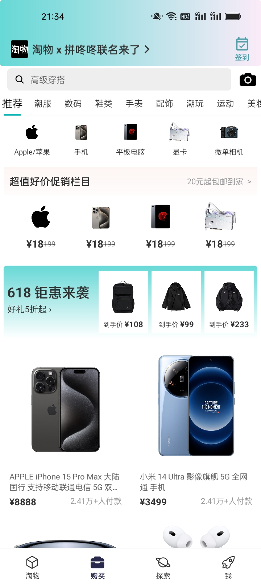
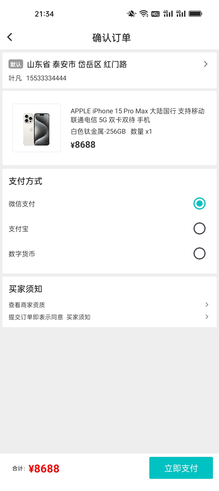
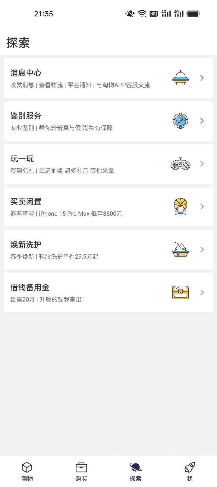
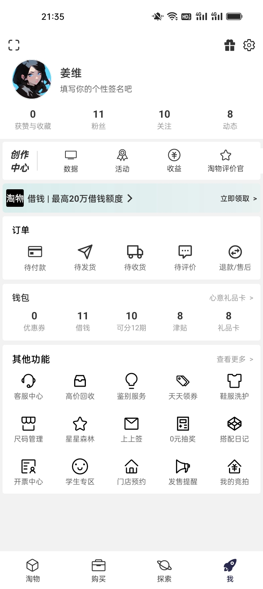

## 淘物 一个使用SpringCloud Alibaba开发的微服务 C2B2C 的社区&交易平台

### 项目介绍
后端使用 SpringCloud Alibaba 开发，移动端使用 React Native 构建，管理后台使用 Arco Design 进行构建，并在支付上接入数字货币（比特币、以太坊UDST、平台Token）支付，后端采用 Hadoop 与 Flink 等大数据框架构建实时计算与离线计算体系。

### 后端项目架构

### 项目特点
* 技术全面：提供多种技术栈，移动端、PC 端、后端皆有支持，且每种技术都是当前较新技术。
* 方案通用：封装的 starter，代码规范，DDD 领域驱动设计，RBAC 权限管理，各种封装的组件可以灵活运用到其他项目中。
* 代码复用：管理后台封装 BaseController，一次继承解决基础增删改查。
* 版本管理：通过 Liquibase 管理数据库版本，跟踪、管理和应用数据库变化。
* 数仓支持：提供 Hadoop 技术栈支持，通过 CDH 构建，实现离线数仓与实时数仓。
* 扩展方案：多种分库分表策略，高并发场景。
* 持续集成：实现 DevOps，通过 DroneCI/Jenkins 实现部署的全流程自动化
* 容器编排：通过 Rancher/DockerSwarm 实现多容器的部署、管理与监控。
* 系统监控：通过 ELK 实现日志监控，通过 SkyWalking 实现链路追踪，通过 Prometheus + Grafana 实现系统监控。
其他：待补充

### APP 截图

|                                                           |                                                           |                                                           |  |  
| :--: | :--: | :--: | :--: |   

|                                                           |                                                           |                                                           |  |  
| :--: | :--: | :--: | :--: |

### 开发环境

### 项目部署

